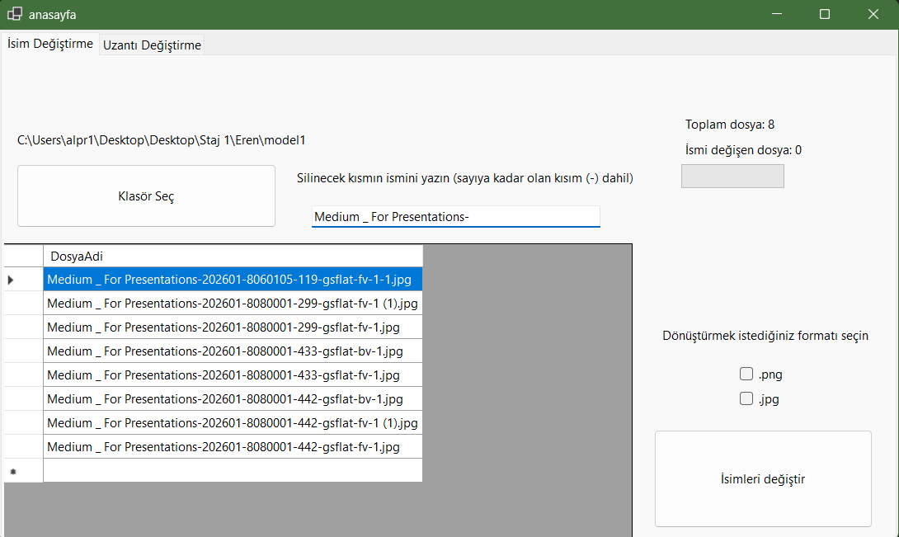
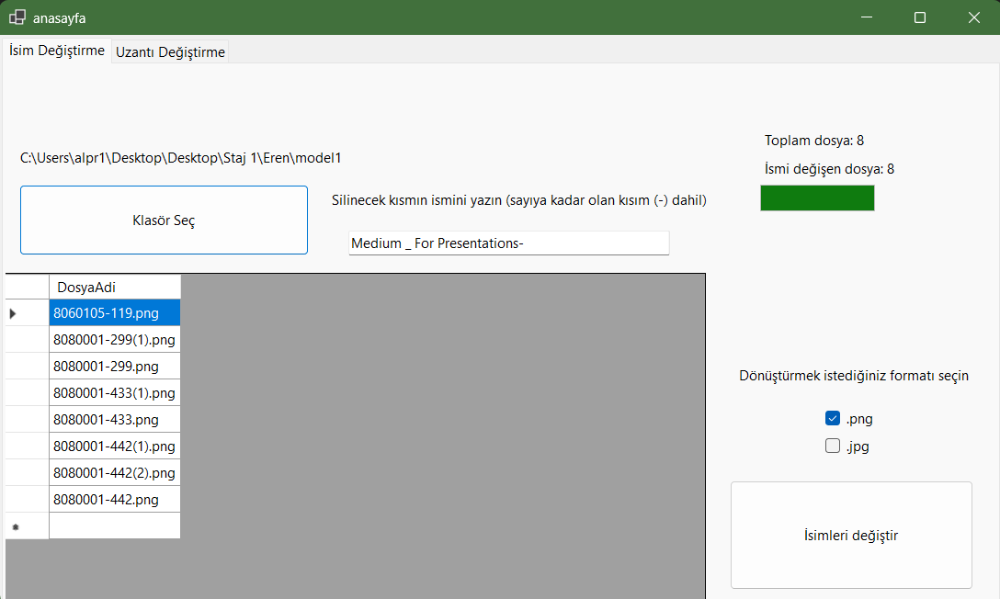
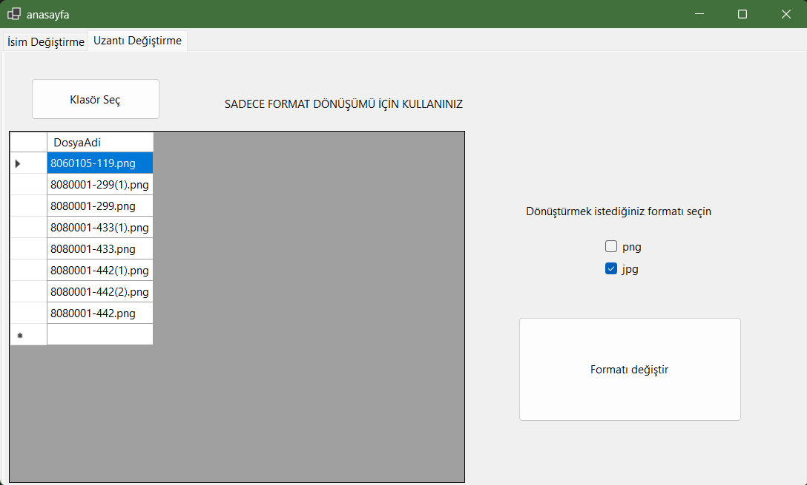
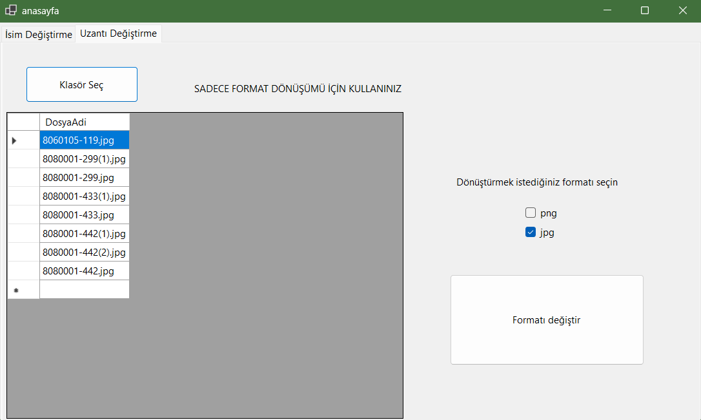

# 📂 Dosya Listeleme, İsim Yeniden Adlandırma ve Format Dönüştürme Aracı  
**(Windows Forms - C#)**

> **This README includes both Turkish and English sections. English version is available below.**  
> **Bu proje .NET Framework ve Windows Forms ortamında geliştirilmiştir.**
 > Bu proje, staj sürecinde bir diğer stajyer arkadaşım ile birlikte ortak geliştirilmiştir.

Bu uygulama, klasör içerisindeki görselleri topluca listelemek, yeniden adlandırmak ve uzantılarını değiştirmek amacıyla geliştirilmiş bir masaüstü yazılımıdır. Sekmeli yapısıyla 3 temel işlev sunar.

---

## 🖼️ Uygulama Arayüzü / Application UI

### Sekme 1 – İsim Değiştirme & SKU-Varyant Ayıklama  
İlk ekran, üretimden gelen uzun dosya adlarını göstermektedir.  
İkinci ekran, girilen silme kriterine göre sadeleştirilmiş hali göstermektedir.

  

---

### Sekme 2 – Format Dönüştürme  
İlk ekran, dosyaların dönüştürülmeden önceki halini (.jpg) göstermektedir.  
İkinci ekran, format dönüşümü sonrası oluşan yeni dosya listesini (.png) göstermektedir.

  

---

## 🇹🇷 SEKME 1: İsim Değiştirme (File Renaming)

### 🎯 Amaç  
Kullanıcının seçtiği klasördeki dosyaların isimlerinden belirli bir kısmı silinir ve yeni bir formatta yeniden kaydedilir.

### ⚙️ Teknik Detaylar  
- `FolderBrowserDialog` ile klasör seçimi  
- `DataGridView` ile görsel listeleme  
- `TextBox` ile silinecek öge girişi  
- `ComboBox` ile hedef uzantı seçimi (.jpg / .png)  
- `System.IO` sınıfı ile dosya işlemleri  
- `ProgressBar` ve sayaç ile kullanıcı bilgilendirme  

### ✅ Kazanımlar  
- Kullanıcı dostu arayüzle toplu dosya düzenleme  
- String ve dosya sistemine yönelik C# pratiği  

---

## 🇹🇷 SEKME 1 (Devam): SKU-Varyant Bilgisi Ayıklama

### 🎯 Amaç  
Karmaşık üretim dosya adlarından yalnızca SKU ve varyant bilgisi çıkarılır.

### ⚙️ Teknik Detaylar  
- Örnek dosya adı: `Medium_For Presentations-202601-8060105-119-gsflat-fv-1-1.jpg`  
- Beklenen çıktı: `8060105-119.jpg`  
- `Substring`, `Split`, `IndexOf` gibi C# metodları  
- Anlık sonuç gösterimi için `DataGridView` kullanımı

### ✅ Kazanımlar  
- Gerçek dünyadaki üretim verilerine yönelik çözüm üretimi  
- String manipülasyonunda ileri seviye pratik  

---

## 🇹🇷 SEKME 2: Uzantı Değiştirme (Format Conversion)

### 🎯 Amaç  
Görsellerin `.jpg` ⇄ `.png` formatları arasında dönüştürülmesi.

### ⚙️ Teknik Detaylar  
- `FolderBrowserDialog` ile klasör seçimi  
- `Bitmap` ile görsel okunması  
- `ImageFormat` sınıfı ile dönüştürme  
- `File.Copy`, `File.Delete`, `Path.Combine` kullanımı  
- Mevcut dosya silinir, yeni formatta yeniden kaydedilir

### ✅ Kazanımlar  
- Görsel işleme ve format değiştirme temelleri  
- Modüler (sekmeli) uygulama geliştirme deneyimi  

---

# 🇬🇧 FILE LISTING, RENAMING & FORMAT CONVERSION TOOL  
**(Windows Forms - C#)**

This desktop application allows users to batch process images by listing them from a selected folder, renaming based on specific patterns, and converting image formats. The project consists of 3 main modules accessible through tabs.

---

## TAB 1: File Renaming

### 🎯 Goal  
To remove a specific pattern from filenames and save the files with a new extension.

### ⚙️ Technical Details  
- `FolderBrowserDialog` for folder selection  
- `DataGridView` for listing files  
- `TextBox` to input pattern to remove  
- `ComboBox` for selecting target extension (.jpg / .png)  
- File handling via `System.IO`  
- `ProgressBar` and counters for user feedback  

### ✅ Gains  
- Efficient UI for batch file renaming  
- C# string manipulation and file handling practice  

---

## TAB 1 (Extended): SKU-Variant Extraction

### 🎯 Goal  
To extract SKU and variant data from long, messy filenames coming from production lines.

### ⚙️ Technical Details  
- Example input: `Medium_For Presentations-202601-8060105-119-gsflat-fv-1-1.jpg`  
- Desired output: `8060105-119.jpg`  
- Utilized `Substring`, `Split`, `IndexOf` methods  
- Instant preview via `DataGridView`

### ✅ Gains  
- Real-life use case implementation  
- Advanced string processing in C#  

---

## TAB 2: Format Conversion

### 🎯 Goal  
Convert all images in a folder between `.jpg` and `.png` formats.

### ⚙️ Technical Details  
- `FolderBrowserDialog` to select a directory  
- `Bitmap` class to read images  
- `ImageFormat` to change file format  
- System functions like `File.Copy`, `File.Delete`, `Path.Combine`  
- Rewrites file in new format and removes the old version

### ✅ Gains  
- Intro to image processing and format handling  
- Modular development with tabbed UI

## 🖼️ Screenshots

### Tab 1 – Before & After (File Renaming and SKU Extraction)  
  

### Tab 2 – Format Conversion (JPG → PNG)  
  

